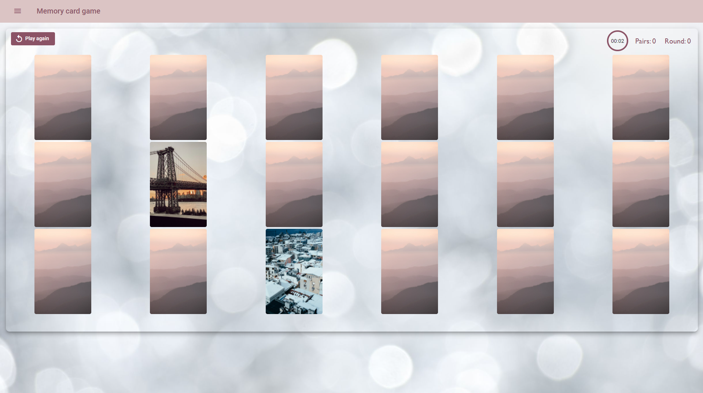
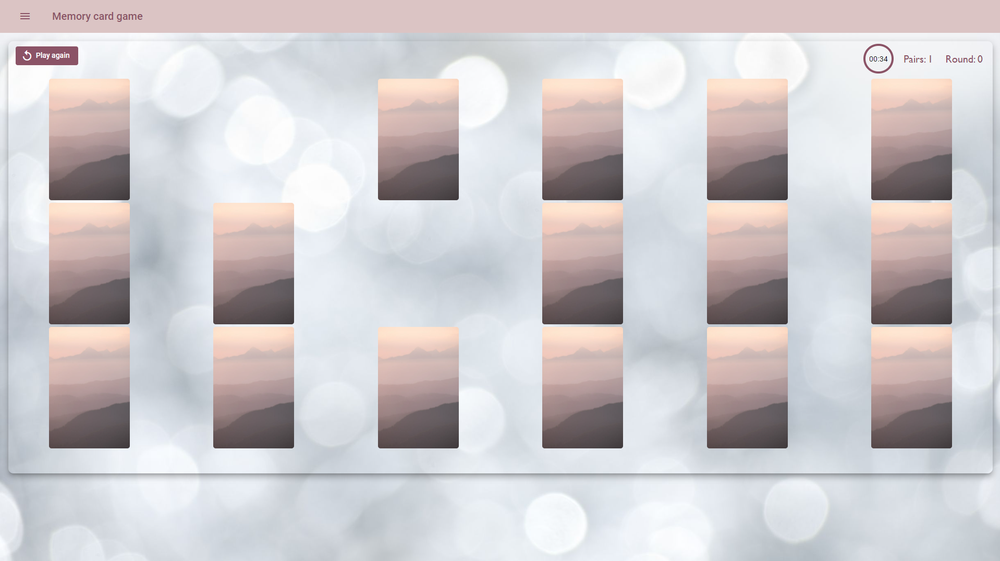
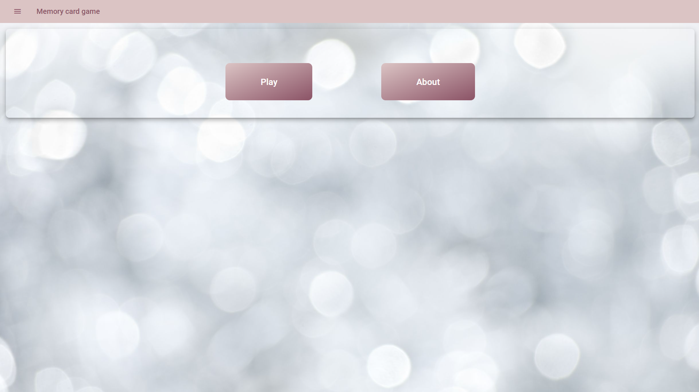
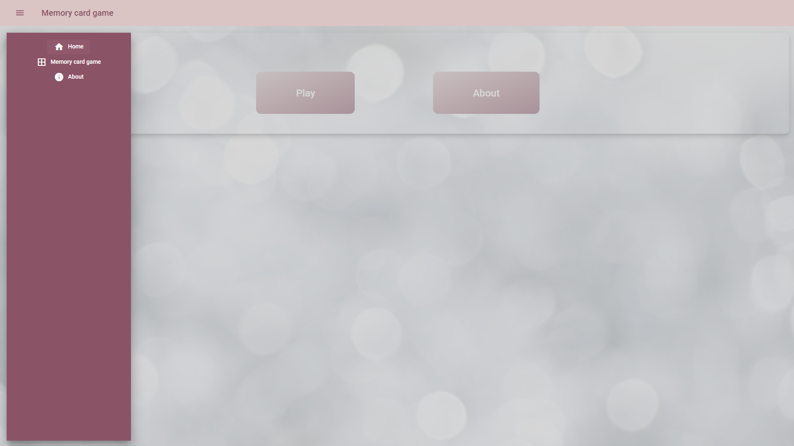
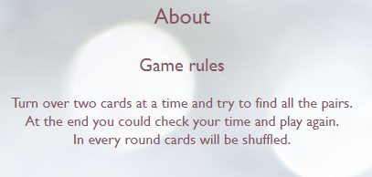
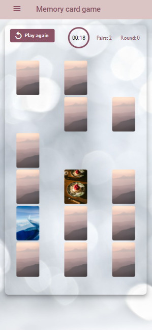

# MemoryCardGame

This project was generated with [Angular CLI](https://github.com/angular/angular-cli) version 12.1.4.

## About

This application is created using Angular, Angular Material, Angular Animations, TypeScript, SCSS and HTML.

This project uses Angular Animations to animate card flip and card disappearing after finding a pair. Animations are triggered by a card flip status which has three states - default, flipped and matched. App is also using Angular Material for UI components.

The built-in game timer which counts time of the game is created using RxJS timer.

Navigation was made with Angular Routing. Application can be used on different media types/devices because of media queries.

Unit tests are created with Jasmine and Karma.

## Game

Game rules are very simple. You are turning out cards and trying to find all the pairs. If you find all of them, you will win. After clicking `play again` you can start again with new shuffeled cards. In the top right corner there is a timer which counts your time, info how many pairs did you find and number of the round which increments when you win.

## Home

Home page contains two buttons - play and info about the game. You can also navigate to the same places through the sidenav.

## About page

About page contains short instruction how to play the game.

## Mobile devices

Game can be run on mobile devices.

